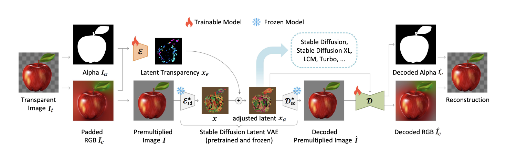

# Layer Diffuse Refiners

Transparent Image Layer Diffusion using Latent Transparency for [refiners](https://github.com/finegrain-ai/refiners/tree/main).



**Note:** This repo only implements layer diffusion for foreground generation base on the [Transparent Image Layer Diffusion using Latent Transparency](https://arxiv.org/abs/2402.17113v3) paper. Click [here](https://github.com/layerdiffusion/sd-forge-layerdiffuse) for the official implementation.

## Get Started:

> Clone this repo

```console
git clone https://github.com/chloedia/layerdiffuse.git
cd layerdiffuse
```

> Set up the environment using [rye](https://rye-up.com/)

```console
rye sync --all-features \
source .venv/bin/activate
```

> Install your sdxl weight files (see [refiners](https://github.com/finegrain-ai/refiners/tree/main) docs).
```console
git clone https://github.com/finegrain-ai/refiners.git\
cd refiners\
rye sync --all-features\
```
> Install all the necessary weights files

```console
curl -L "https://huggingface.co/chloedia/layerdiffusion4refiners/blob/main/unet.safetensors" --output "checkpoints/unet.safetensors"
curl -L "https://huggingface.co/chloedia/layerdiffusion4refiners/blob/main/text_encoder.safetensors" --output "checkpoints/text_encoder.safetensors"
curl -L "https://huggingface.co/chloedia/layerdiffusion4refiners/blob/main/lda.safetensors" --output "checkpoints/lda.safetensors"

curl -L "https://huggingface.co/chloedia/layerdiffusion4refiners/blob/main/vae_transparent_decoder.safetensors" --output "vae_transparent_decoder.safetensors"
curl -L "https://huggingface.co/LayerDiffusion/layerdiffusion-v1/resolve/main/layer_xl_transparent_attn.safetensors" --output "layer_xl_transparent_attn.safetensors"
```

And you are ready to go ! You can start by launching the generation of a cute panda wizard by simply running :

```console
python3 src/layerdiffuse/inference.py --checkpoint_path "checkpoints/" --prompt "a futuristic magical panda with a purple glow, cyberpunk" --save_path "outputs/"
```

Go check into the refiners [docs](https://refine.rs/guides/adapting_sdxl/#multiple-loras) and especially the part to add loras or Adapters on top of the layer diffuse, create the assets for any of your creations that matches a specific style.

## Example of outputs


## What's Next ?

> Add style aligned to the generated content, to align a batch to the same style with or without a ref image;

> Add post processing for higher details quality (hands);

Don't hesitate to contribute! 🔆

---

Thanks to @limiteinductive for his help toward this implementation !
